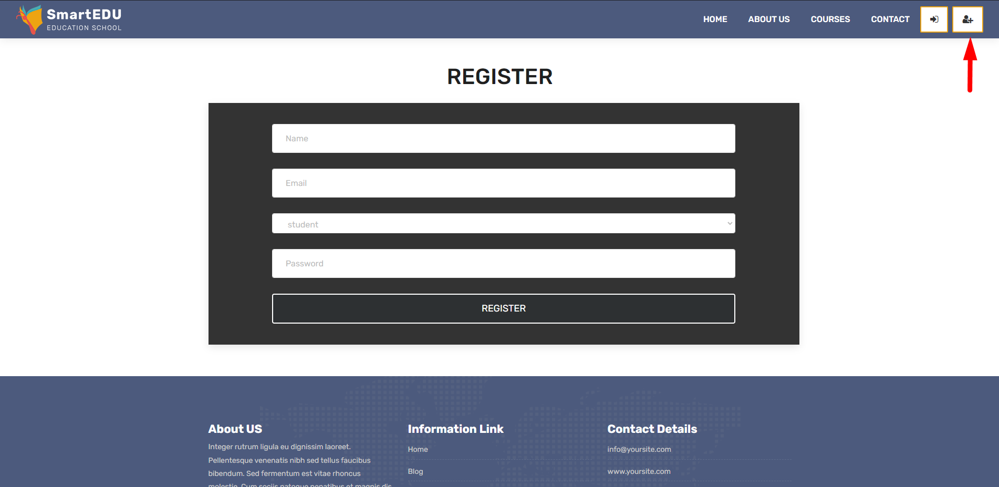
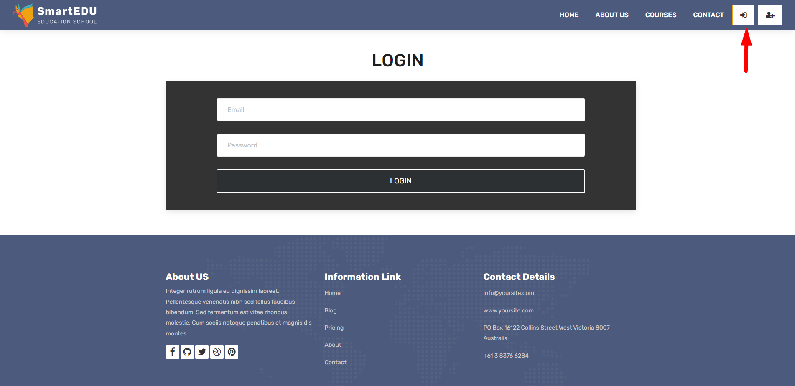
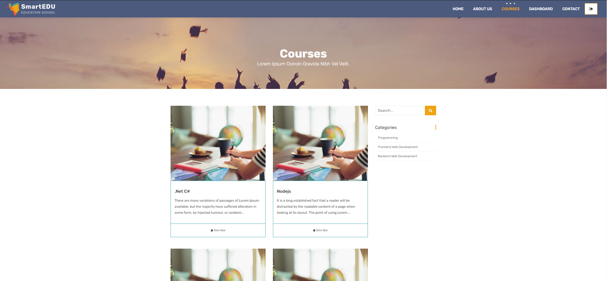
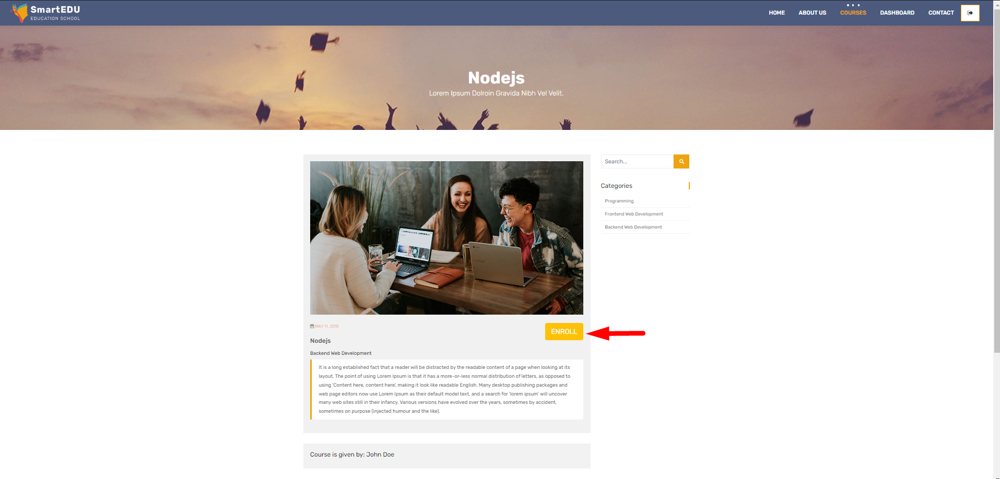
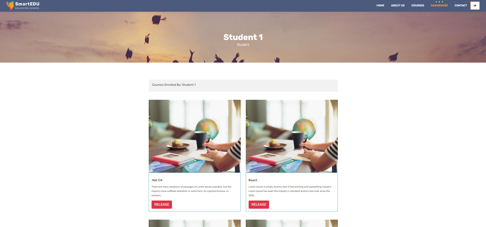
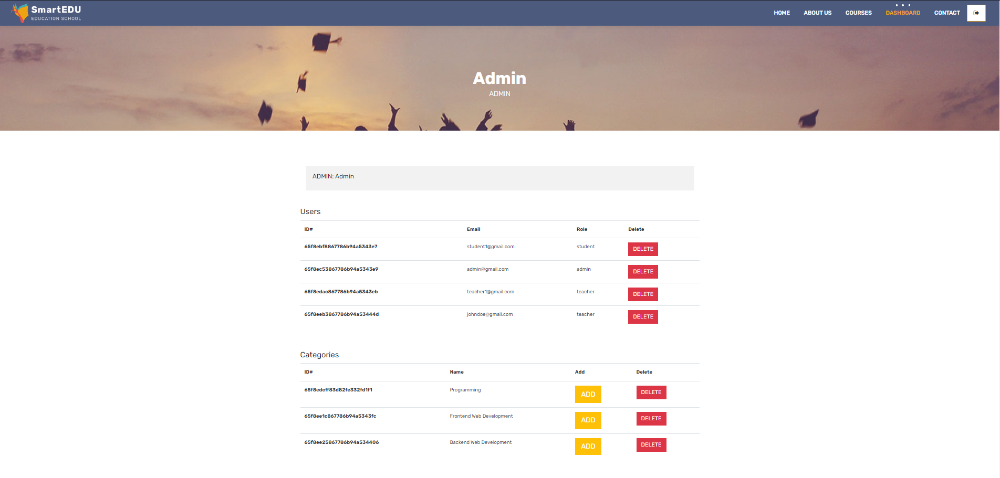

# SmartEdu Educational Portal

**LIVE DEMO:** [SmartEdu](https://smartedu-mtt7.onrender.com/)

SmartEdu is an Educational Portal web application developed with nodejs. This project lets you Register, Login, View your dashboard, Enroll/Release a course, Update/Delete a course, Filter the courses, Delete the users, Add categories.

---

## Installation

In the project directory, you should run the commands below:

#### `npm install`

#### `npm start`

Also make sure to connect your own database before you start the app. DB connection is located in the app.js folder.

```ruby
mongoose
  .connect(process.env."mongodb://localhost:27017", {})
  .then(() => {
    console.log("DB CONNECTED");
  })
  .catch((err) => {
    console.log(err);
  });
```

---

# Project Preview

#### Register Page

You can register to the system either being a student or a teacher.



#### Log in Page

You can log in to the system here. After logging in, a dashboard page shows up on the navbar.



#### Courses Page

You can view courses created by teachers.



#### Single Course Page

You can see the details of each course by clicking on them and enroll the course from here.



#### Dashboard Page

Students can release the courses they have taken from here. Teachers can create a new course or update their courses.



#### Admin Panel

If your role is admin in the system, you can delete users, add categories in the dashboard page.

```
admin@gmail.com
pass123
```



---

## Used technologies

- User Authentication
- User Log in
- Custom Middlewares
- Password Encryption
- Create Categories
- Search Field
- Sessions
- Postman
- Relations between Models
- Slugify

---
